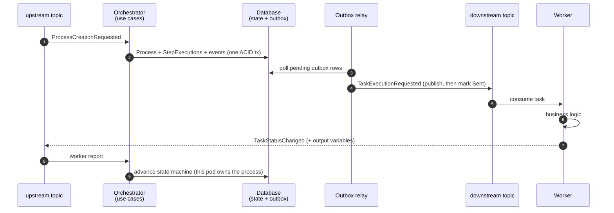

EventConductor's architecture can be summarized in one sentence: **a hexagonal engine embedded in your application, whose every state transition is an immutable event written in the same ACID transaction as the state itself**. Everything else — distribution, scaling, recovery — falls out of that decision.

## The big picture

<svg viewBox="0 0 960 660" width="960" height="660" xmlns="http://www.w3.org/2000/svg" role="img" aria-label="EventConductor architecture: actors on top (operators, AI agents, other services), your Spring Boot application containing inbound adapters, the hexagonal engine core and outbound adapters, a database with state and outbox table below, and Kafka topics with horizontally scaled workers on the right." style="max-width:100%;height:auto;font-family:inherit">
  <defs>
    <marker id="arr" viewBox="0 0 10 10" refX="9" refY="5" markerWidth="7" markerHeight="7" orient="auto-start-reverse">
      <path d="M 0 1 L 9 5 L 0 9 z" fill="currentColor" opacity="0.65"/>
    </marker>
  </defs>
  <g stroke="currentColor" fill="none" opacity="0.9">
    <!-- actors -->
    <g opacity="0.75">
      <rect x="40" y="18" width="180" height="44" rx="8" stroke-opacity="0.4"/>
      <rect x="250" y="18" width="180" height="44" rx="8" stroke-opacity="0.4"/>
      <rect x="640" y="18" width="220" height="44" rx="8" stroke-opacity="0.4"/>
    </g>
    <g stroke="none" fill="currentColor" font-size="12.5">
      <text x="130" y="37" text-anchor="middle" font-weight="600">Operators</text>
      <text x="130" y="53" text-anchor="middle" opacity="0.65" font-size="11">management UI</text>
      <text x="340" y="37" text-anchor="middle" font-weight="600">AI agents</text>
      <text x="340" y="53" text-anchor="middle" opacity="0.65" font-size="11">MCP · natural language</text>
      <text x="750" y="37" text-anchor="middle" font-weight="600">Other services</text>
      <text x="750" y="53" text-anchor="middle" opacity="0.65" font-size="11">integration events</text>
    </g>
    <!-- ghost pods -->
    <rect x="64" y="122" width="520" height="330" rx="12" stroke-opacity="0.18"/>
    <rect x="52" y="111" width="520" height="330" rx="12" stroke-opacity="0.30"/>
    <!-- app container -->
    <rect x="40" y="100" width="520" height="330" rx="12" stroke-opacity="0.75" stroke-width="1.5"/>
    <g stroke="none" fill="currentColor">
      <text x="56" y="124" font-size="13" font-weight="700">Your Spring Boot application</text>
      <text x="544" y="124" font-size="11" text-anchor="end" opacity="0.6">orchestrator · ×n pods</text>
    </g>
    <!-- inbound adapters -->
    <g stroke-opacity="0.45">
      <rect x="58" y="146" width="128" height="40" rx="7"/>
      <rect x="58" y="196" width="128" height="40" rx="7"/>
      <rect x="58" y="246" width="128" height="40" rx="7"/>
      <rect x="58" y="296" width="128" height="40" rx="7"/>
      <rect x="58" y="346" width="128" height="40" rx="7"/>
    </g>
    <g stroke="none" fill="currentColor" font-size="11" text-anchor="middle">
      <text x="122" y="163">UI (Mateu)</text><text x="122" y="177" opacity="0.6">pages · editors</text>
      <text x="122" y="213">REST</text><text x="122" y="227" opacity="0.6">Git webhook (HMAC)</text>
      <text x="122" y="263">MCP server</text><text x="122" y="277" opacity="0.6">@Tool methods</text>
      <text x="122" y="313">Schedulers</text><text x="122" y="327" opacity="0.6">cron · timer · timeout</text>
      <text x="122" y="363">Event consumers</text><text x="122" y="377" opacity="0.6">upstream · worker events</text>
    </g>
    <!-- application ring + domain hexagon -->
    <rect x="210" y="146" width="250" height="240" rx="10" stroke="#C27D2C" stroke-opacity="0.55" fill="#C27D2C" fill-opacity="0.05"/>
    <g stroke="none" fill="currentColor" font-size="11">
      <text x="335" y="164" text-anchor="middle" opacity="0.75">application — use cases · services</text>
    </g>
    <polygon points="335,192 398,228 398,300 335,336 272,300 272,228"
             stroke="#C27D2C" stroke-width="2" fill="#C27D2C" fill-opacity="0.14"/>
    <g stroke="none" fill="currentColor" text-anchor="middle">
      <text x="335" y="252" font-size="13" font-weight="700">Domain</text>
      <text x="335" y="270" font-size="11" opacity="0.7">Process · StepExecution</text>
      <text x="335" y="285" font-size="11" opacity="0.7">WorkflowDefinition</text>
    </g>
    <g stroke="none" fill="currentColor" font-size="10.5" text-anchor="middle" opacity="0.75">
      <text x="335" y="372">state machine only — business logic lives in workers</text>
    </g>
    <!-- outbound adapters -->
    <g stroke-opacity="0.45">
      <rect x="478" y="196" width="68" height="64" rx="7"/>
      <rect x="478" y="296" width="68" height="64" rx="7"/>
    </g>
    <g stroke="none" fill="currentColor" font-size="11" text-anchor="middle">
      <text x="512" y="222">JPA /</text><text x="512" y="236">memory</text><text x="512" y="250" opacity="0.6">+ outbox</text>
      <text x="512" y="322">Kafka</text><text x="512" y="336">producer</text><text x="512" y="350" opacity="0.6">downstream</text>
    </g>
    <!-- module chips -->
    <g stroke-opacity="0.35">
      <rect x="58" y="398" width="118" height="22" rx="11"/>
      <rect x="186" y="398" width="102" height="22" rx="11"/>
      <rect x="298" y="398" width="100" height="22" rx="11"/>
    </g>
    <g stroke="none" fill="currentColor" font-size="10.5" text-anchor="middle" opacity="0.8">
      <text x="117" y="413">workflow-engine</text>
      <text x="237" y="413">forms-engine</text>
      <text x="348" y="413">rule-runtime</text>
    </g>
    <!-- database -->
    <g>
      <path d="M 150 508 q 0 -14 145 -14 q 145 0 145 14 v 96 q 0 14 -145 14 q -145 0 -145 -14 z" stroke-opacity="0.7" stroke-width="1.5"/>
      <path d="M 150 508 q 0 14 145 14 q 145 0 145 -14" stroke-opacity="0.7" stroke-width="1.5"/>
    </g>
    <g stroke="none" fill="currentColor" text-anchor="middle">
      <text x="295" y="548" font-size="12.5" font-weight="700">PostgreSQL / Oracle / H2</text>
      <text x="295" y="567" font-size="11" opacity="0.75">process state + outbox table — same ACID transaction</text>
      <text x="295" y="584" font-size="11" opacity="0.75">events keyed by process: one owning pod per process</text>
    </g>
    <!-- kafka -->
    <rect x="640" y="150" width="280" height="180" rx="12" stroke-opacity="0.6" stroke-width="1.5"/>
    <g stroke="none" fill="currentColor">
      <text x="656" y="174" font-size="13" font-weight="700">Kafka</text>
    </g>
    <g stroke-opacity="0.45">
      <rect x="656" y="190" width="248" height="30" rx="15"/>
      <rect x="656" y="232" width="248" height="30" rx="15"/>
      <rect x="656" y="274" width="248" height="30" rx="15"/>
    </g>
    <g stroke="none" fill="currentColor" font-size="11.5" font-family="ui-monospace, SFMono-Regular, Menlo, monospace">
      <text x="672" y="209">upstream</text>
      <text x="672" y="251">downstream</text>
      <text x="672" y="293">outbox</text>
    </g>
    <g stroke="none" fill="currentColor" font-size="10.5" opacity="0.6" text-anchor="end">
      <text x="896" y="209">events in</text>
      <text x="896" y="251">tasks out</text>
      <text x="896" y="293">domain events</text>
    </g>
    <!-- workers -->
    <rect x="664" y="422" width="256" height="120" rx="12" stroke-opacity="0.18"/>
    <rect x="652" y="411" width="256" height="120" rx="12" stroke-opacity="0.30"/>
    <rect x="640" y="400" width="256" height="120" rx="12" stroke-opacity="0.7" stroke-width="1.5"/>
    <g stroke="none" fill="currentColor" text-anchor="middle">
      <text x="768" y="438" font-size="13" font-weight="700">Workers ×n</text>
      <text x="768" y="458" font-size="11" opacity="0.75">stateless Kafka consumers</text>
      <text x="768" y="474" font-size="11" opacity="0.75">your business logic · any language</text>
      <text x="768" y="496" font-size="11" opacity="0.75">scale = add instances to the group</text>
    </g>
    <!-- arrows -->
    <g stroke-opacity="0.55" fill="none" marker-end="url(#arr)">
      <line x1="130" y1="62" x2="130" y2="97"/>
      <line x1="340" y1="62" x2="340" y2="97"/>
      <line x1="750" y1="62" x2="750" y2="148"/>
      <line x1="186" y1="266" x2="208" y2="266"/>
      <line x1="460" y1="228" x2="476" y2="228"/>
      <path d="M 546 228 Q 598 228 598 360 Q 598 482 450 508"/>
      <path d="M 546 328 Q 610 328 652 252"/>
      <path d="M 440 560 Q 618 560 652 292"/>
      <line x1="768" y1="332" x2="768" y2="398"/>
      <path d="M 898 400 Q 942 330 908 222"/>
      <path d="M 664 188 Q 622 76 400 76 Q 200 76 154 96"/>
    </g>
    <!-- flow badges -->
    <g>
      <circle cx="560" cy="76" r="11" fill="#C27D2C" stroke="none"/>
      <circle cx="598" cy="368" r="11" fill="#C27D2C" stroke="none"/>
      <circle cx="556" cy="560" r="11" fill="#C27D2C" stroke="none"/>
      <circle cx="768" cy="366" r="11" fill="#C27D2C" stroke="none"/>
      <circle cx="934" cy="316" r="11" fill="#C27D2C" stroke="none"/>
    </g>
    <g stroke="none" fill="#fff" font-size="12" font-weight="700" text-anchor="middle">
      <text x="560" y="80.5">1</text>
      <text x="598" y="372.5">2</text>
      <text x="556" y="564.5">3</text>
      <text x="768" y="370.5">4</text>
      <text x="934" y="320.5">5</text>
    </g>
  </g>
</svg>

**The numbered flow:** ① an integration event (e.g. `ProcessCreationRequested`, `MessageReceived`, a worker report) arrives through the `upstream` topic or in-process; ② the engine advances its state machine and writes the new state **plus** the resulting domain events to the outbox table in one ACID transaction; ③ the outbox relay publishes pending events (publish-then-mark — at-least-once, never lost); ④ `TaskExecutionRequested` events reach workers via the `downstream` topic; ⑤ workers execute your business logic and report `TaskStatusChanged` back through `upstream` — and the loop continues until an `END` step completes the process.

## The hexagon, mapped to packages

The engine is strictly hexagonal — the diagram above is not marketing geometry, it is the actual package layout of `workflow-engine`:

| Layer | Package | Contents |
|---|---|---|
| **Domain** | `domain/aggregates` | `Process`, `StepExecution`, `WorkflowDefinition` — pure state machine, no framework code. Each `Process` carries an immutable JSON snapshot of its definition. |
| **Application** | `application/usecases`, `application/services` | One use case per operation (create process, update step, correlate message, retry, cancel, check timers…), plus services like `ProcessAnalyticsService`. Ports to the outside live in `application/out`. |
| **Inbound adapters** | `infra/in` | `async` (event consumers), `rest` (Git import webhook), `ui` (the Mateu-built management UI), `mcp` (the MCP server and its `@Tool`s), `scheduler` (cron starts, timer & timeout scans), `startup` (classpath importers). |
| **Outbound adapters** | `infra/out` | `persistence` (JPA repositories, outbox writer, per-vendor SQL for PostgreSQL/Oracle/MariaDB/H2), `async` (Kafka producers / embedded relay), `memory` (in-memory repositories for the zero-infrastructure mode), `classpath` (definition loading). |

Because business logic is banned from the definition *and* from the engine, the domain stays small enough to reason about — and to pin down exhaustively in [TESTING.md](https://github.com/miguelperezcolom/eventconductor/blob/main/TESTING.md).

## The life of a step

Duplicates are expected and absorbed by design: a second `ProcessCreationRequested` with the same business key creates nothing, a duplicate dispatch for a step already past `PENDING` is ignored, and a late worker report on a terminal step is discarded. Idempotency lives in the engine so your workers only need to be idempotent about their own side effects.

## Distributed coordination without a coordinator

There is no leader election, no consensus protocol and no engine cluster to operate.

**Every event carries its process as the Kafka message key.** All the events of a process therefore
hash to the same partition, and a consumer group hands each partition to exactly one consumer — so
exactly one pod is ever working a given process. Serialization is not something the engine arranges
after the fact; it is a property of how the events are addressed. The same key gives per-process
**ordering**, which an unkeyed topic does not provide at all.

That leaves three pieces doing the work:

- **Transactional outbox** — state change and event are atomic, and the relay re-delivers after any
  crash (at-least-once). The pod that writes a row wakes its own relay, so the poll interval is a
  fallback for other pods' rows rather than latency on every step.
- **Ownership by partition** — described above. It is also why sharding the database by process id
  would scale cleanly: shards never coordinate.
- **An optimistic version** on the process and its steps, fencing the one gap ownership leaves. A
  consumer group guarantees which consumer is *assigned* a partition, not which is still *in
  flight*: during a rebalance the outgoing pod can be finishing a record the incoming one now owns.
  A stale write is rejected instead of overwriting, and rejections are counted
  (`eventconductor.process.concurrent.writes.rejected`) so the assumption can be watched rather
  than trusted.

In `embedded` mode there are no partitions to own, so a row lock on the process takes their place.
The engine used to work that way everywhere, with a per-process advisory lock; ownership replaced
it in `kafka` mode because a lock that arranges what the log already guarantees is pure cost.

The corollary is the engine's performance model: **it orchestrates, it doesn't execute** — workers
do the heavy lifting and scale horizontally on Kafka, so the only resource that grows with
orchestration throughput is database write capacity. See [Performance](/guides/performance/) for
what the engine costs per transition and how to measure it yourself.

## Time, messages and rules

Three inbound adapters make processes react to more than worker reports:

- **Schedulers** — `TIMER` steps (wait for a duration or until a date in a process variable), cron-scheduled process starts (`cronExpression` on the definition) and the timeout scan that drives hung tasks through retry/error/compensation.
- **Message correlation** — `WAIT_FOR_MESSAGE` steps pause until a `MessageReceived` event with a matching correlation key (JEXL `correlationExpression`) arrives, merging its variables into the process; `SEND_MESSAGE` steps emit one, so processes can signal each other without a worker in between.
- **Rules** — `RULE` steps evaluate expression rules or decision tables from the rule catalog via the embeddable `rule-runtime`, locally or over REST/gRPC with a Kafka-refreshed cache.

## One architecture, three sizes

The same code runs in three modes selected purely by configuration — the adapters swap, the hexagon doesn't notice:

| Mode | What changes | Infrastructure |
|---|---|---|
| `embedded` + `memory` | in-memory repositories, synchronous event dispatch | none |
| `embedded` + `jpa` | JPA repositories, in-process outbox relay | a database |
| `kafka` + `jpa` | Kafka topics between orchestrator and workers, one owning pod per process | database + Kafka |

Details and configuration in [Deployment Modes](/guides/deployment-modes/).
