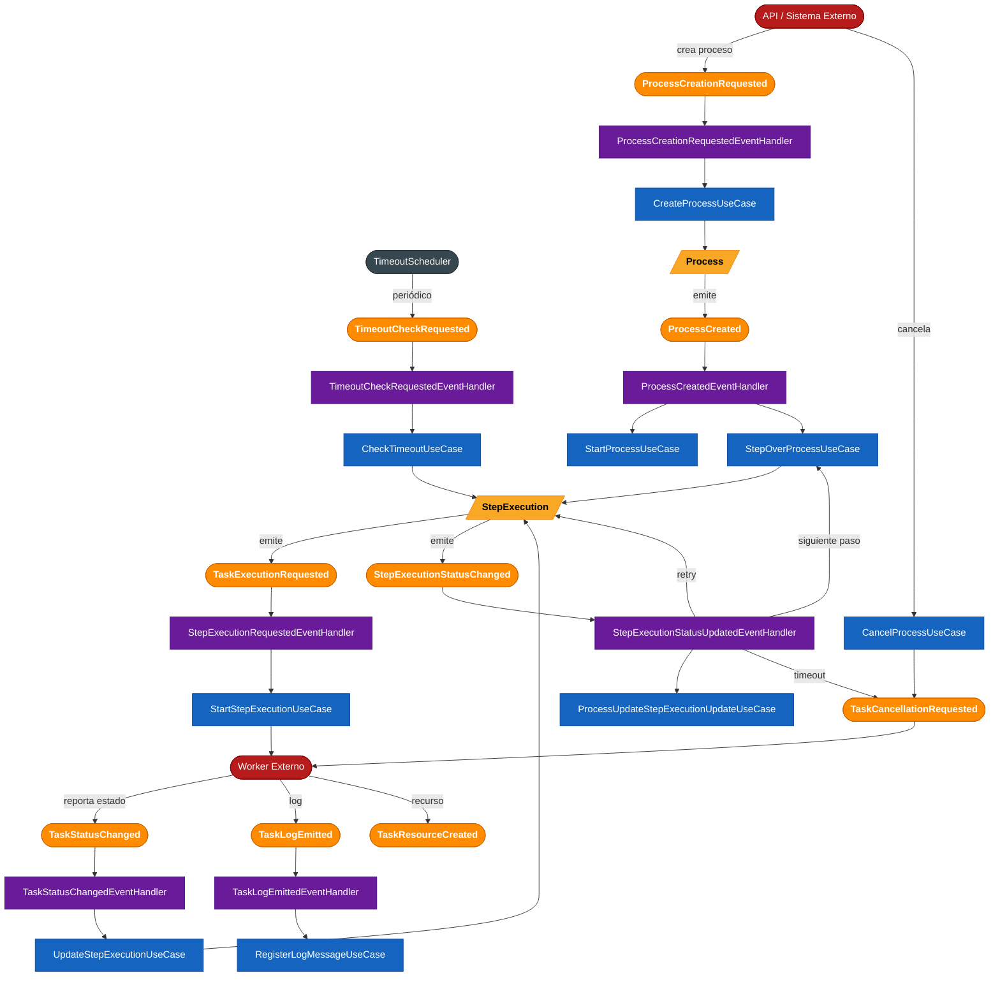

This page documents the Event Storming of the Workflow Engine module. It maps every domain event, command, aggregate, and policy extracted directly from the source code.

## Overview

The Workflow Engine is structured around two event streams:

- **Domain events** — produced by aggregates (`Process`, `StepExecution`) and consumed internally via the outbox pattern.
- **Integration events** — exchanged with external systems (workers, API callers) via Kafka or Spring embedded events.

## Event Flow Diagram



**Colour legend:**
- Orange — Domain / integration events
- Blue — Commands / Use Cases
- Yellow — Aggregates (`Process`, `StepExecution`)
- Purple — Policies / Event Handlers
- Red — External systems (API caller, Worker)
- Dark grey — Scheduler

---

## Flows

### Flow 1 — Process Creation

An external system or API sends `ProcessCreationRequested`. The engine creates a `Process` aggregate, which emits `ProcessCreated`. The handler then starts every eligible entry step — the `START` roots complete instantly (fanning the flow out to their successors) and `WAIT_FOR_MESSAGE` roots arm their wait.

```
ProcessCreationRequested
  → ProcessCreationRequestedEventHandler
  → CreateProcessUseCase
  → Process.create()  emits  ProcessCreated
  → ProcessCreatedEventHandler
  → StartProcessUseCase + StepOverProcessUseCase
```

### Flow 2 — Step Execution

`StepOverProcessUseCase` creates a `StepExecution` and starts it. The aggregate emits `TaskExecutionRequested`, which is delivered to the worker.

```
StepOverProcessUseCase
  → StepExecution.start()  emits  TaskExecutionRequested
  → StepExecutionRequestedEventHandler
  → StartStepExecutionUseCase
  → Worker
```

### Flow 3 — Worker Feedback (Happy Path)

The worker reports the outcome via `TaskStatusChanged`. The engine updates the step, emits `StepExecutionStatusChanged`, and either advances to the next step or completes the process.

```
TaskStatusChanged  (from Worker)
  → TaskStatusChangedEventHandler
  → UpdateStepExecutionUseCase
  → StepExecution.updateStatus()  emits  StepExecutionStatusChanged
  → StepExecutionStatusUpdatedEventHandler
  → ProcessUpdateStepExecutionUpdateUseCase
  → StepOverProcessUseCase  →  (next step — loop to Flow 2)
```

### Flow 4 — Timeout

`TimeoutScheduler` fires periodically. If a step has exceeded its timeout, the step is marked `TIMEOUT`. Depending on configuration, the engine retries the step or starts a compensation step.

```
TimeoutScheduler
  → TimeoutCheckRequested
  → TimeoutCheckRequestedEventHandler
  → CheckTimeoutUseCase
  → StepExecution  emits  StepExecutionStatusChanged(TIMEOUT)
  → StepExecutionStatusUpdatedEventHandler
      ├─ if retries available  →  StepExecution (loop to Flow 2)
      ├─ if compensation step  →  compensation StepExecution (loop to Flow 2)
      └─ otherwise             →  Process marked ERROR
                                   + TaskCancellationRequested → Worker
```

### Flow 5 — Process Cancellation

An actor (UI, MCP tool, or your own code) invokes `CancelProcessUseCase` directly — there is no upstream cancellation event with a handler. The engine sends `TaskCancellationRequested` to any running worker. The worker responds with `TaskStatusChanged(CANCELLED)`, which re-enters Flow 3.

```
CancelProcessUseCase.handle(new CancelProcessCommand(processId))
  → TaskCancellationRequested → Worker
```

### Flow 6 — Logs & Resources

Workers can emit log messages and resource references at any point during execution. These are stored independently of step status.

```
TaskLogEmitted     → TaskLogEmittedEventHandler → RegisterLogMessageUseCase
TaskResourceCreated  (stored; no further handler currently)
```

---

## Event Catalogue

| Event | Type | Produced by | Consumed by |
|---|---|---|---|
| `ProcessCreationRequested` | Integration (upstream) | External API / caller | `ProcessCreationRequestedEventHandler` |
| `ProcessCreated` | Domain | `Process` aggregate | `ProcessCreatedEventHandler` |
| `ProcessCancellationRequested` | Integration (upstream) | — (declared but never raised; cancellation is a direct call to `CancelProcessUseCase`) | — (no handler) |
| `TaskExecutionRequested` | Integration (downstream) | `StepExecution` aggregate | Worker |
| `TaskCancellationRequested` | Integration (downstream) | `CancelProcessUseCase`, timeout handler | Worker |
| `TaskStatusChanged` | Integration (upstream) | Worker | `TaskStatusChangedEventHandler` |
| `TaskLogEmitted` | Integration (upstream) | Worker | `TaskLogEmittedEventHandler` |
| `TaskResourceCreated` | Integration (upstream) | Worker | — (stored, no handler yet) |
| `StepExecutionStatusChanged` | Domain | `StepExecution` aggregate | `StepExecutionStatusUpdatedEventHandler` |
| `StepExecutionsCreationRequested` | Integration | — | — (defined, not yet handled) |
| `TimeoutCheckRequested` | Integration (downstream) | `TimeoutScheduler` | `TimeoutCheckRequestedEventHandler` |

---

## Aggregates

### Process

Represents a running instance of a workflow definition.

| Status | Meaning |
|---|---|
| `PENDING` | Created, waiting for first step |
| `COMPLETED` | All steps finished successfully |
| `CANCELLED` | Cancellation requested and confirmed |
| `ERROR` | A step failed with no remaining retries or compensation |

### StepExecution

Represents the execution of a single step within a process.

| Status | Meaning |
|---|---|
| `CREATED` | Initialised, not yet started |
| `PENDING` | Handed off to the worker |
| `RUNNING` | Worker has acknowledged execution |
| `COMPLETED` | Worker reported success |
| `ERROR` | Worker reported failure, no retries left |
| `CANCELLED` | Cancelled before completion |
| `TIMEOUT` | Did not complete within the configured timeout |

State transitions:

```
CREATED → PENDING → RUNNING → COMPLETED
                             → ERROR
                             → CANCELLED
                             → TIMEOUT → (retry)  → RUNNING
                                       → (compensate) → new step
```

---

## Infrastructure

Event delivery uses one of two transports, selectable via configuration:

| Mode | Transport |
|---|---|
| `embedded` | Spring `ApplicationEventPublisher` (in-process) |
| `kafka` | Apache Kafka topics (distributed) |

Domain events from aggregates are stored in an **outbox table** before being published, guaranteeing at-least-once delivery and consistency with the database transaction.
