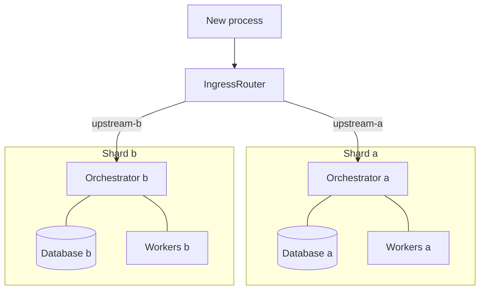
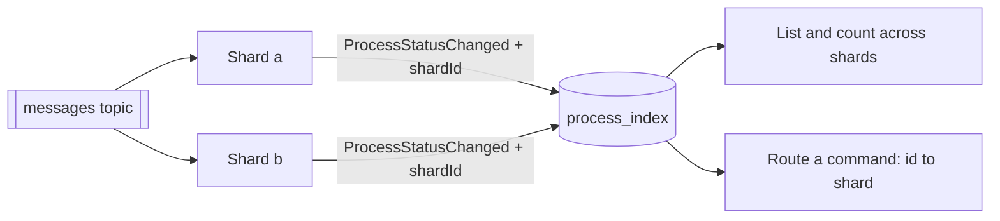

A process is keyed to a partition and lives entirely on one node: that is the property the whole
engine is built on, and it is why ownership never needs coordinating. **Sharding is what that
property buys you.** Run N complete stacks side by side, each with its own database, and writes scale
with the shard count rather than with how big one PostgreSQL can get.

It is **opt-in and off by default**. A workflow definition never mentions it, a worker never notices
it, and nothing about writing processes changes. If one database is enough — and for most
deployments it is, see [Performance](/guides/performance/) — you can stop reading here.

## What a shard is

A shard is a full engine: its own orchestrator pods, its own database, its own `upstream-<id>` and
`downstream-<id>` topics. Shards **never talk to each other** and never share a transaction. Adding
one adds capacity; losing one does not stop the others.

The **router** is the only place a shard is ever chosen. Everything to the right of it is
self-contained: a process placed on shard *a* is created, run, retried and finished there, and shard
*b* never hears about it.

Two things do cross, and they are the only two:

A **shared messages topic**, because a sender cannot know which shard is waiting; and the
**read model**, which is what lets anything ask a question spanning shards — and, because it records
where each process lives, what lets a command find its way back to one.

## Routing: four cases, and only one of them chooses

**New processes — the router places them.** It reads the registry, picks an active shard, and
publishes to that shard's `upstream`. This is the only decision point in the system.

**Work in flight — local by construction.** Workers of shard *a* consume `downstream-a` and reply to
`upstream-a`; a `PROCESS` step spawns its child on the shard its parent is on. None of it leaves the
shard, which is why adding or removing *other* shards cannot disturb a run already going.

**Messages — one shared topic every shard consumes.** A `SEND_MESSAGE` does not know which shard is
waiting for it, and with elastic shards it cannot be computed. So the message goes to a single
`messages` topic; every shard correlates it against its own waiting steps, the owner wakes, and the
rest match nothing and drop it. This is the one engine change sharding needs, and it is exactly what
keeps the shard count out of the routing.

**Operator commands — looked up.** Retry, cancel, pause and resume have to reach the shard that owns
the process, and the id does not say which. The [process index](/guides/process-index/) does: every
`ProcessStatusChanged` is stamped with its shard, so the read model built for querying at scale
doubles as the command router.

## Placement: the part that is easy to get wrong

The router follows two rules, in order.

**Idempotency wins.** A business key is placed exactly once, and every later request for that key
goes to the shard it was placed on. A retry, a broker redelivery, or cron's deterministic
per-occurrence key must land back on the same shard — otherwise the per-shard creation guard cannot
collapse the duplicate, and the fleet grows two processes for one key.

**New keys spread**, round-robin across the active shards. Round-robin and *not* `hash(key) % N`,
precisely so that adding or removing a shard never re-routes an existing key. That is the property
that makes the fleet elastic; a modulus would reshuffle the world every time you scaled.

:::caution[Set the placement datasource]
How rule one is answered matters more than it looks. With
`workflow.sharding.placement.datasource.url` set, the shard is **claimed synchronously** — one
atomic statement whose winner and losers all read back the same placement — and the claim is
authoritative.

Without it the router falls back to looking the key up in the read model, which is eventually
consistent. Across a sharded fleet, a redelivery arriving before the projection catches up is placed
a second time, on a different shard, and **nothing downstream notices**: two processes, one business
key. The engine warns about this at startup rather than refusing to start, because the store is
opt-in like everything else here — but a sharded fleet without it is one redelivery away from that.
:::

## Scaling hot

The **shard registry** is the list of shards currently accepting new processes, and it is the only
thing you change to scale.

- `workflow.sharding.active-shards` — a static CSV. Fine to start with; a change needs a restart.
- `workflow.sharding.registry-file` — a path re-read on an interval. In Kubernetes that is a mounted
  ConfigMap, so editing it scales the fleet **with no restart**. A read error keeps the last good
  list rather than emptying the fleet.

**Draining is removal from that list.** Take a shard out and new processes stop arriving; the work
already on it finishes where it is, because in-flight work never moves. When the shard is empty you
can take it down. Nothing migrates, nothing is rebalanced — that is the point.

## What sharding does not change

Workflow definitions, workers, forms and rules are all unaware of it. A worker consumes its shard's
topic and answers on it; it never learns there are others. And with sharding **off** — the default —
messages and commands go through the local `upstream` exactly as they always did, so none of this
sits in the path of a single-database deployment.

## Turning it on

The switch is `workflow.sharding.enabled`, and every property is in the
[configuration reference](/reference/configuration/#sharding-advanced-opt-in): the shard id, the
registry, and the placement datasource.

Two things worth having in place first: the [process index](/guides/process-index/), because without
it nothing can list or count across shards and commands have no way home; and the placement
datasource above.

The design notes and the Kubernetes manifests a sharded fleet was validated with live in the
benchmark module — `k8s/scale/sharded/README.md` and `k8s/reliability/ELASTIC-SHARDING-DESIGN.md`.
